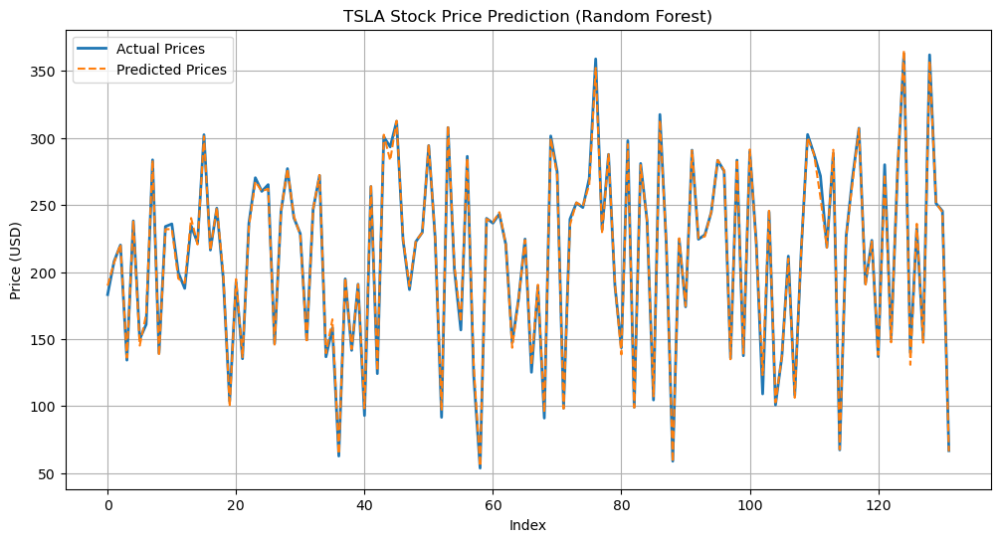

# StockTree: Stock Price Prediction using Decision Trees & Random Forests

## Overview

**StockTree** is a stock price prediction tool that utilizes **Decision Tree** and **Random Forest** models to analyze and predict stock prices based on historical data. The project evaluates the effectiveness of these models across different stock tickers, including **S&P 500 companies**, and assesses the impact of various evaluation metrics.

## Features

- 📈 **Data Fetching & Preprocessing**: Automatically fetches stock data using `yfinance` and prepares key indicators like **Moving Averages, Daily Returns, and Lagged Close prices**.
- 🤖 **Model Training**: Implements **Decision Tree** and **Random Forest** models to predict stock closing prices.
- 🔍 **Evaluation Metrics**: Computes **Mean Squared Error (MSE)** and **Mean Absolute Percentage Error (MAPE)** to assess model performance.
- 🏛 **Industry-Wide Analysis**: Applies models across multiple **S&P 500 tickers**, analyzing trends and industry-specific prediction errors.
- 📊 **Visualization**: Plots **actual vs. predicted** stock prices for model evaluation.

## Function Summary

### **Data Fetching & Preprocessing**
- **`fetch_and_prepare_data(ticker, start_date, end_date)`**  
  Fetches historical stock data and computes key indicators such as moving averages, daily returns, and lagged close prices.

### **Model Training**
- **`train_models(X_train, y_train)`**  
  Trains **Decision Tree** and **Random Forest** models using the provided training data.

### **Generating Predictions**
- **`get_preds(models, X_test)`**  
  Generates predictions for stock prices using trained models.

### **Evaluation Metrics**
- **`eval_mse(y_test, y_pred_dt, y_pred_rf)`**  
  Computes the **Mean Squared Error (MSE)** to measure the absolute prediction error.  
- **`eval_mape(y_test, y_pred_dt, y_pred_rf)`**  
  Computes the **Mean Absolute Percentage Error (MAPE)** to account for scale differences between stocks.

### **Visualization**
- **`plot_predictions(y_test, predictions, title)`**  
  Plots actual vs. predicted stock prices to visualize model performance.

### **Train & Evaluate Multiple Stocks**
- **`train_and_eval_models(ticker, start_date, end_date, eval_metric)`**  
  Fetches, preprocesses, trains, and evaluates models on a given stock, supporting different evaluation metrics.

## Results 📊

Below are the visualizations of **TSLA stock price predictions** using **Decision Tree** and **Random Forest** models.

### **TSLA Stock Price Prediction (Decision Tree)**

### **TSLA Stock Price Prediction (Random Forest)**

- **Random Forest consistently outperforms Decision Trees**, reducing overfitting and capturing more complex patterns.
- **MAPE provides a better evaluation metric than MSE** when comparing predictions across stocks with different price scales.
- Certain industries exhibit **higher prediction errors** due to greater volatility and complexity, such as **Software - Infrastructure** and **Biotechnology**.

## Future Work 🚀

- **Explore neural networks (LSTMs, RNNs)** to improve predictions on time-series stock data.
- **Implement additional evaluation metrics** like **Root Mean Squared Logarithmic Error (RMSLE)** and **Normalized MSE (NMSE)**.
- **Optimize hyperparameters** using **Grid Search** or **Bayesian Optimization**.

---
